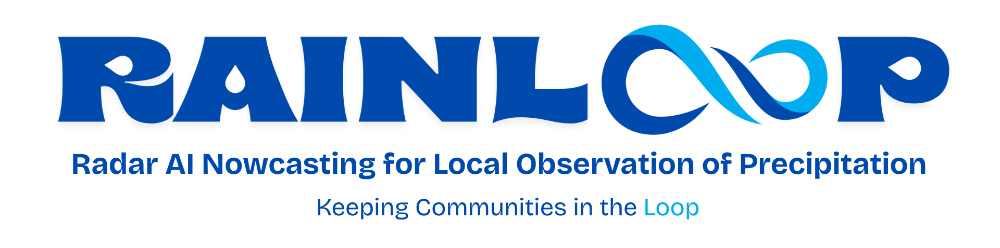
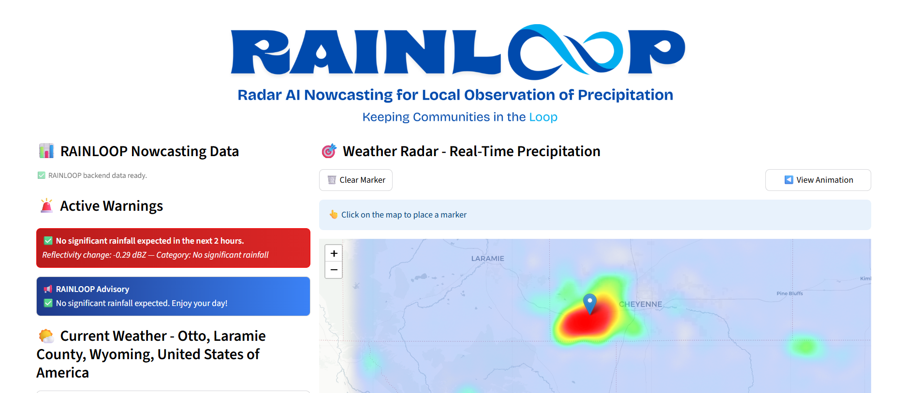

# PJDSC 2025  
### Sana All-gorithm  

**Authors:** 
Fernan Frans B. Pelobello 
Maxine Van L. Caparas 
Ma. Angelika C. Regoso 
Pamela Anne C. Serrano

# Radar Reflectivity-Based Nowcasting Framework for Short-Term Rainfall Prediction

This project develops an **end-to-end framework for short-term rainfall prediction** using nowcasted radar reflectivity (dBZ). It combines advanced deep learning and AI technologies to provide actionable weather insights:

- **RainNet-Based Nowcasting Model:** Leveraging radar reflectivity data to predict rainfall intensity in the near term.  
- **AI-Powered Chatbot:** An OpenAI LLM chatbot interprets model outputs and delivers actionable recommendations to users.  
- **Interactive Web App:** A Streamlit application visualizes predictions with intuitive heatmaps and alerts, making the system user-friendly and accessible.

The web app automatically updates rainfall predictions every 10 minutes using the RainNet nowcasting model, while the AI-powered chatbot provides actionable insights based on the latest data.

The framework enables **proactive decision-making** for weather-sensitive activities by integrating cutting-edge AI with real-time meteorological data.

## Requirements
- Python: https://www.python.org/downloads
  - **Note**: Python versions `3.13.x` and above do not work properly with this web app. Install an older version (up to `3.12.x`)
- pip (pre-installed with Python): https://pypi.org/project/pip/

## Setting-up
- Clone the project with `https://github.com/fernanfrans/sana_all-gorithm.git`
- Move to the main directory with `cd sana_all-gorithm`
- Create a virtual environment with `python3 -m venv venv`
  - **Note**: If starting the command with `python3` does not work, use the exact Python version installed (e.g., `python3.12`)
- Activate the virtual environment with `venv\Scripts\activate` (Windows) or `source venv/bin/activate` (Unix/MacOS)
- Install the dependencies with `pip install -r requirements.txt`
- Create `.env` to store the needed secrets and keys (see `config/.env.example` for reference).
    - For the purposes of this project submission, the secrets and keys were included in the repository.
- Create `/.streamlit/secrets.toml` (see `config/.env.example` for reference).

## Running the Web App
- In the same directory, start the application with `streamlit run rainloop.py`
- Usually, the web app page automatically opens on a certain browser. If not, open the application by going to `localhost:8501` on any browser.
